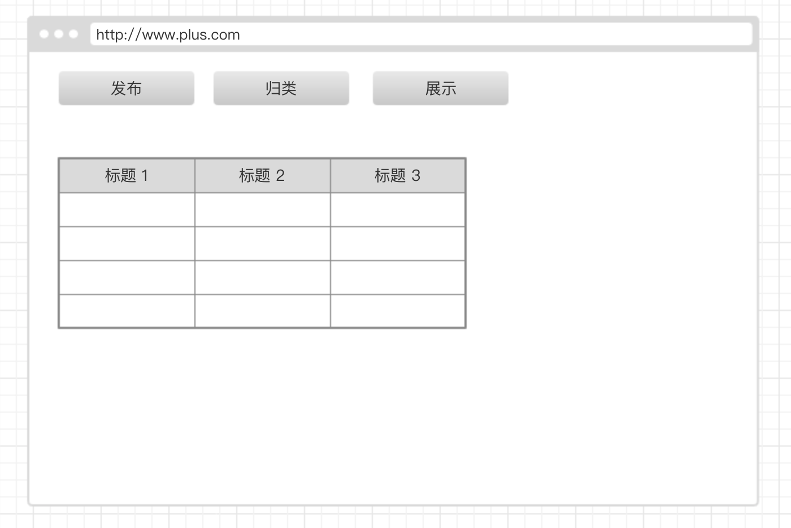

# myblog

## 敏捷开发实践

1. 明确需求，设计原型图
   (1). 第一版先实现环境搭建，快速上线为主
   
2. 开发环境搭建
   (1). 版本管理工具：git,
   (2). 代码托管平台：github,
   (3). 持续集成平台：travis,
   (4). 代码编辑器：vscode,
   (5). 风格检查工具：ESLint,
   (6). 测试工具: Karma,istanbul,chai,mocha
   (7). 开发框架(暂定): vue,vuex,vue-rout,axios,koa2
   (8). 数据库: redis, mongoDB 
   (9). 开发语言: javascript
   (10). 打包工具webpack
   (11). 语言编译工具typescript

## 架构设计

```
1. 目录结构搭建
├── README.md //项目简介
├── assets //静态资源存放目录
├── build //打包工具配置目录
│   └── webpack.config.js
├── package.json //包管理配置文件
├── protoImg //原型图目录
│   └── 1.jpg
├── src //开发目录
│   ├── common //存放公共组件
│   └── components //组件
└── util //存放工具库

2. tasking拆解
 (1). UI界面无特殊要求，先上线
 (2). 真正需要的环境
     1. 打包环境 webpack
     2. 测试环境 ui功能测试
     3. 集成环境 travis平台
     4. 可以先无后台数据

3. 在gh-pages分支上开发
```

